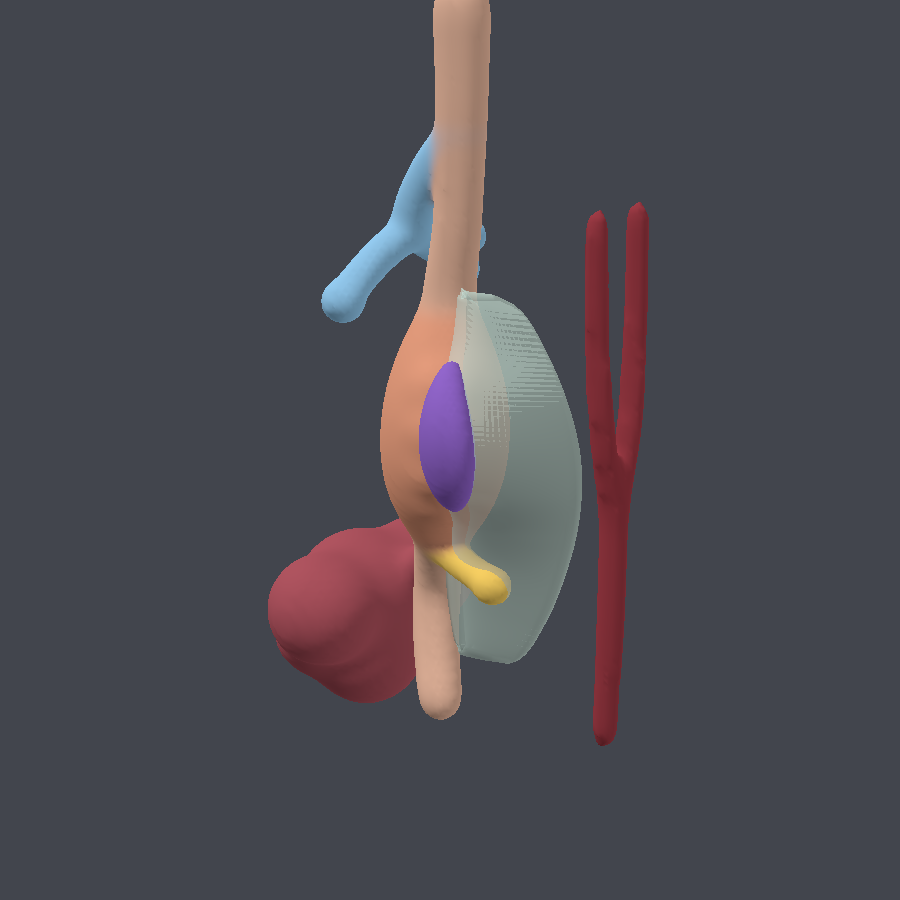

# E10.5 마우스 배아 foregut — 비장 원기(splenic anlage) 융기 구조

일러스트/3D 작업용 **베이스 메시**입니다. 연구용 정량 재현이 아니라 "그림에서 형태가
읽히는 것"이 목표라서, 상대적인 위치·방향은 발생학 교과서 수준으로 맞추고 크기와
융기 정도는 조금 과장했습니다.

| 파일 | 설명 |
| --- | --- |
| `models/e105_foregut_spleen.glb` | 완성된 모델 (약 1.3 MB, 44k tris) |
| `tools/foregut_model.py` | 파라메트릭 생성기 (외부 라이브러리 없음) |
| `tools/preview_render.py` | 브라우저 없이 돌리는 미리보기 렌더러 |
| `docs/preview_*.png` | 네 방향 미리보기 |



## 무엇을 그렸나

E10.5 시점에서 위(stomach)는 아직 foregut의 방추형 팽대일 뿐이고, **비장은 위장관
상피에서 나오는 게 아니라 등쪽위간막(dorsal mesogastrium) 안의 중배엽(splanchnic
mesoderm)이 왼쪽에서 두꺼워지면서 융기**합니다. 그래서 모델은 이렇게 구성했습니다.

| 노드 이름 | 내용 | 색 |
| --- | --- | --- |
| `Foregut_Stomach_Duodenum` | 식도 → 위 → 십이지장 상피관, 기관·폐아, 등쪽/배쪽 췌장아까지 한 덩어리(연속된 내배엽) | 살구색 / 하늘색(폐) / 노랑(췌장) |
| `LiverBud` | 간아. 배쪽(ventral)에 크게 자리 | 진한 적자색 |
| `DorsalMesogastrium` | 등쪽위간막. 위 대만곡에서 등쪽 체벽까지 걸린 얇은 막, 반투명 | 연한 청록 |
| `SpleenAnlage` | **비장 원기.** 등쪽위간막의 왼쪽 면, 대만곡 바로 옆에서 두미방향으로 길쭉하게 융기 | 보라 |
| `DorsalAorta_ref` | 등쪽대동맥(두측은 한 쌍, 미측은 융합). 위치 감 잡는 용도 | 어두운 붉은색 |

형태 포인트

- 위의 **대만곡이 좌-등쪽**을 향하고, 등쪽위간막은 그 능선에 붙습니다. 위 회전은
  아직 시작 단계라 좌측으로 살짝만 기울여 놨습니다.
- 등쪽위간막은 식도쪽·십이지장쪽에서 짧고, **위 높이에서 가장 깊고 왼쪽으로 부풀어**
  있습니다. 비장 원기는 그 부푼 곳 한가운데, 대만곡 쪽(v≈0.26)에 있습니다.
- 비장 원기는 두측이 두껍고 미측으로 가늘어지는 방추형이고, 간막 표면보다 왼쪽으로
  더 튀어나오도록 렌즈 모양으로 눌러 놨습니다(`spleen_offset`).
- 등쪽 췌장아는 비장 원기 바로 미측·등쪽에서 나옵니다. 두 구조의 위치 관계가
  이 시기 그림에서 제일 헷갈리는 부분이라 일부러 같이 넣었습니다.

## 좌표계와 스케일

생성기 내부 좌표는 `+X = 배아의 왼쪽`, `+Y = 머리쪽`, `+Z = 배쪽`이고 **1 unit = 100 µm**
입니다(위 지름 약 2.3 unit ≈ 230 µm).

GLB에는 루트 노드에 **Y축 −90° 회전**이 들어 있습니다. model-viewer 기본 카메라
(`camera-orbit="45deg 65deg"`)가 비장이 융기하는 좌-등쪽 면을 바로 보게 하려는
용도입니다. Blender에서 해부 좌표계 그대로 쓰고 싶으면 루트 노드 회전만 지우거나

```bash
python3 tools/foregut_model.py --no-view-rotation --out models/anat_axes.glb
```

로 다시 뽑으면 됩니다.

## 다시 뽑기 / 형태 조절

```bash
python3 tools/foregut_model.py --cell 0.115 --out models/e105_foregut_spleen.glb
python3 tools/preview_render.py --cell 0.115 --size 900 --out docs   # 미리보기
```

`tools/foregut_model.py` 맨 위 `PARAMS`만 만져도 인상이 꽤 바뀝니다.

| 파라미터 | 역할 |
| --- | --- |
| `cell` | 복셀 크기. 0.09이면 더 매끈하고 무겁고, 0.18이면 가볍고 뭉툭 |
| `spleen_length` / `spleen_thickness` | 비장 원기 길이·두께 배율 |
| `spleen_offset` | 간막 표면에서 왼쪽으로 얼마나 더 튀어나올지 (융기 강조) |
| `stomach_fat`, `gc_bulge` | 위 팽대 / 대만곡 능선 돌출 |
| `meso_thickness`, `meso_bulge`, `meso_alpha` | 등쪽위간막 두께·부풀기·투명도 |
| `show_liver`, `show_lungs`, `show_aorta` | 주변 구조 on/off |

기관 위치 자체를 옮기려면 `foregut_blobs()`의 제어점 좌표를 바꾸면 됩니다. 튜브는
`add_tube(제어점, 반지름들, 색)`, 덩어리는 `add_ball(중심, 반지름, 색)`이고, 겹치는
것들끼리 메타볼(soft union)로 부드럽게 이어 붙습니다.

## 작업 파이프라인 제안

1. 이 GLB를 뷰어 페이지에서 **Choose GLB**로 열어 각도를 잡아 봅니다.
   (공유 링크로 쓰려면 **Upload & Copy Link**로 올리면 됩니다.)
2. Blender로 임포트 → 노드별로 오브젝트가 분리되어 있으니 필요 없는 것(대동맥, 간)은
   숨기고, 정점 컬러(`COLOR_0`)가 들어 있으니 머티리얼에서 Color Attribute로 바로
   쓸 수 있습니다.
3. Surface Nets 격자 흔적이 남아 있으므로 실제 렌더용으로는 **Remesh(Voxel) →
   Shrinkwrap/Smooth** 또는 스컬프팅으로 한 번 정리하는 걸 권합니다.
4. 반투명 간막은 `DorsalMesogastrium_mat`의 알파(0.55)로 들어가 있습니다.

## 한계

교과서 그림을 3D로 옮긴 수준의 모식도입니다. 실제 배아의 체절·체벽·혈관 배치나
정확한 치수, 좌우 비대칭 정도는 반영하지 않았습니다. 논문용 figure로 쓸 거라면
실제 절편/3D 재구성 데이터(예: EMAP eMouseAtlas)를 기준으로 형태를 다시 잡으세요.
